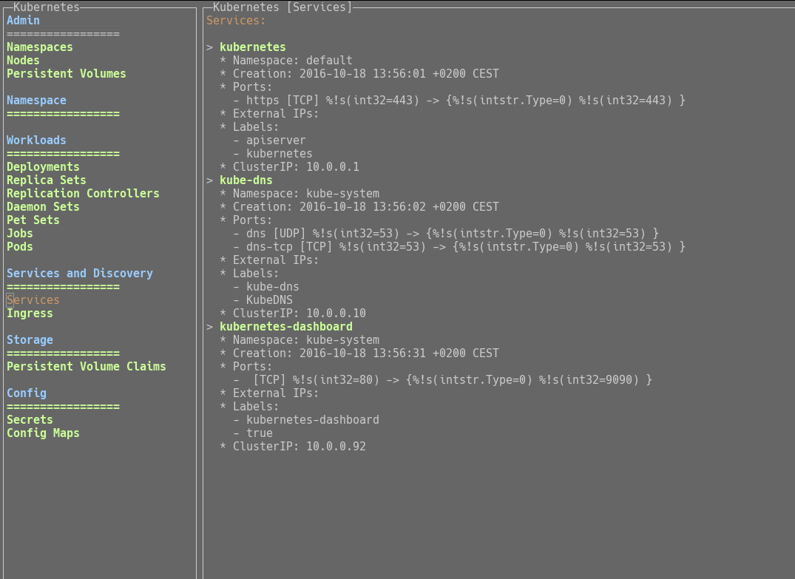

# helmsman

[![License Apache 2][badge-license]](LICENSE)

This is a simple TextUI for [Kubernetes][].

## Installation

You can download the binaries :

* Architecture i386 [ [linux](https://bintray.com/artifact/download/nlamirault/oss/helmsman-0.1.0_linux_386) / [darwin](https://bintray.com/artifact/download/nlamirault/oss/helmsman-0.1.0_darwin_386) / [freebsd](https://bintray.com/artifact/download/nlamirault/oss/helmsman-0.1.0_freebsd_386) / [netbsd](https://bintray.com/artifact/download/nlamirault/oss/helmsman-0.1.0_netbsd_386) / [openbsd](https://bintray.com/artifact/download/nlamirault/oss/helmsman-0.1.0_openbsd_386) / [windows](https://bintray.com/artifact/download/nlamirault/oss/helmsman-0.1.0_windows_386.exe) ]
* Architecture amd64 [ [linux](https://bintray.com/artifact/download/nlamirault/oss/helmsman-0.1.0_linux_amd64) / [darwin](https://bintray.com/artifact/download/nlamirault/oss/helmsman-0.1.0_darwin_amd64) / [freebsd](https://bintray.com/artifact/download/nlamirault/oss/helmsman-0.1.0_freebsd_amd64) / [netbsd](https://bintray.com/artifact/download/nlamirault/oss/helmsman-0.1.0_netbsd_amd64) / [openbsd](https://bintray.com/artifact/download/nlamirault/oss/helmsman-0.1.0_openbsd_amd64) / [windows](https://bintray.com/artifact/download/nlamirault/oss/helmsman-0.1.0_windows_amd64.exe) ]
* Architecture arm [ [linux](https://bintray.com/artifact/download/nlamirault/oss/helmsman-0.1.0_linux_arm) / [freebsd](https://bintray.com/artifact/download/nlamirault/oss/helmsman-0.1.0_freebsd_arm) / [netbsd](https://bintray.com/artifact/download/nlamirault/oss/helmsman-0.1.0_netbsd_arm) ]

## Usage

Launch UI (example with [minikube][] configuration):

    $ helmsman -kubeconfig ~/.kube/config

Type <kbd>C-q</kbd> to exit.

## Contributing

See [CONTRIBUTING](CONTRIBUTING.md).

## License

See [LICENSE](LICENSE) for the complete license.

## Changelog

A [changelog](ChangeLog.md) is available

## Contact

Nicolas Lamirault <nicolas.lamirault@gmail.com>

[badge-license]: https://img.shields.io/badge/license-Apache2-green.svg?style=flat

[Kubernetes]: https://github.com/kubernetes/kubernetes
[minikube]: https://github.com/kubernetes/minikube
